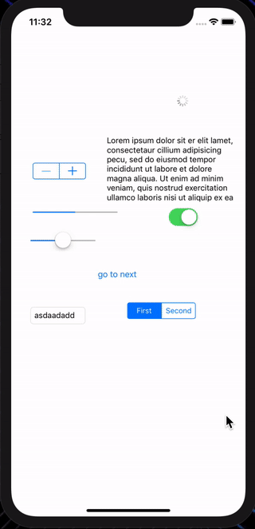
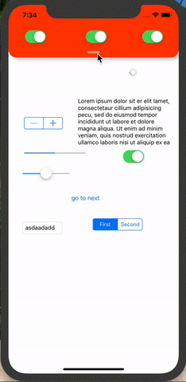
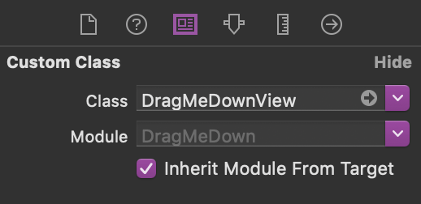
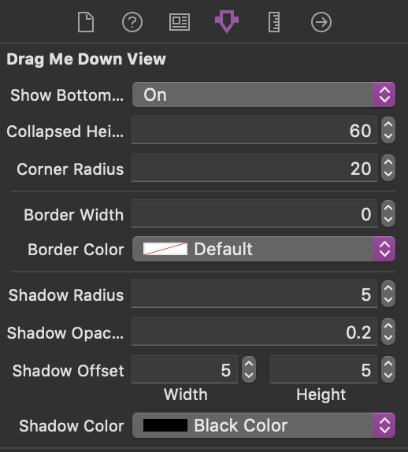

# Read Carefully

You can use this helper in 2 separate ways !

# 1-DragViewToDismiss

It's a modal view that you can drag it down to dismiss it.

# Usage

Just download the demo project and copy paste the codes to your project.
I create this for test and practice so the codes are not perfect but they work.

# 2-ExpandableTopView

This one is much cooler.

You can create a simple view with any height you want in top of your controller and put anything you want in there.
thats it!

# Usage

Just copy 'DragMeDownView.swift' to your project & subclass your top view from it.

You can adjust some details about it in storyboard as well.

notice1: turn show bottom line 'on' if you want thay small line in the bottom of your view.

notice2: collapsed height is the minimum height of your view when its collapsed!

